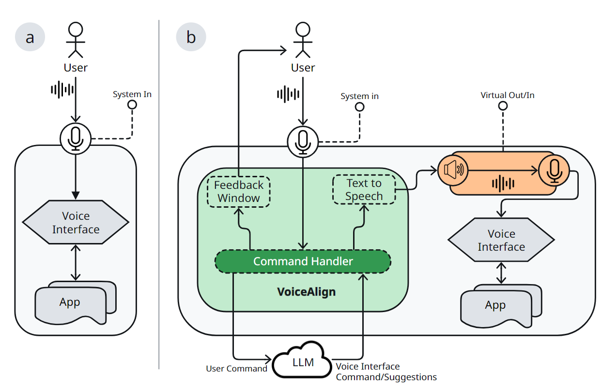
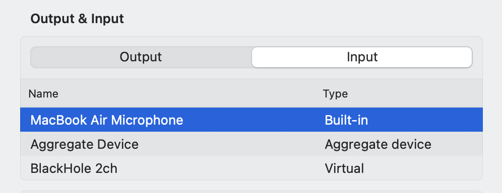
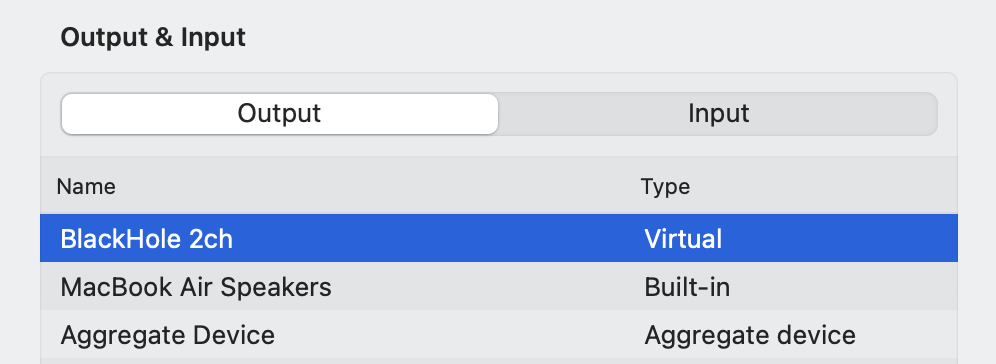
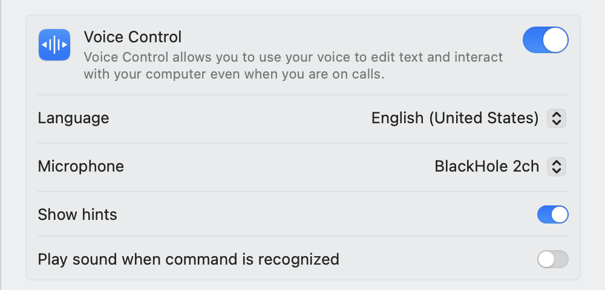

# VoiceAlign: An LLM-Driven Shimming Layer to Enhance the Usability of Blackbox Voice Command Systems


VoiceAlign is an LLM-assisted shimming layer to convert users natural voice commands to a fixed-format command that can be understood by the underlying system. How VoiceAlign differs works with existing systems is shown in the above figure. Existing fixed-syntax command systems, suc has VoiceControl on iOS directly
receive voice commands and interact with applications. Commands that do not match the syntax are discarded. VoiceAlign considers existing voice interfaces as black boxes and establishes a shim layer between the uttered voice commands and the voice interface for communication. The system input is intercepted by a command handler that leverages a Large Language Model (LLM) to match the command to the fixed syntax. This corrected command is relayed to a virtual output channel through Text-to-Speech (TTS). Another virtual input channel takes the corrected TTS output command and provides it as input to the voice interface that interacts with the applications. The command handler provides appropriate feedback throughout the process using a feedback window.

## Preparing the Virtual Input/Output
To intercept the user’s voice command before the voice interface receives it as input, we first create virtual
input and output channels and set the voice interface to listen from the virtual input channel continuously. This allows VoiceAlign to listen to the system input without conflict and process the command before it reaches the target voice interface.

We used an open-source system [Blackhole](https://github.com/ExistentialAudio/BlackHole "Title") to create the virtual input and output channels on MacOS. Details about the installation and configuration of Blackhole can be found on the GitHub page. Here we summarize the steps to create the virtual channels.

1. Install Blackhole on your system.

2. Keep the system input as the default


3. Set the system output to Blackhole's virtual output channel.


4. Set the voice interface (VoiceControl in our case) to listen from Blackhole's virtual input channel .


## Installation and Development

1. Install an http server: 
```bash
npm install -g http-server
```

2. Open a terminal/powershell and navigate to the project directory.
```bash
cd path/to/VoiceAlign
```

3. Run the server: 
```
http-server
```

4. Open a browser and navigate to the development URL shown in the terminal.

## Usage
1. Prepare the virtual input/output channels as described above.

2. Download the code from the repository

3. Tweak the prompt and the API in the `voicealign.js` file as per your requirement. The current prompt has been tested to work with Claude 3.5 Sonnet API and VoiceControl on iOS.

4. Replace `YOUR_API_KEY` with your Claude API key in the `voicealign.js` file at line 22.
```javascript
const API_KEY = "YOUR_API_KEY";
```

5. Run the server and open the development URL in a browser.

6. Select a TTS voice from the dropdown. We recommend using the `Samantha` voice for the best results.

7. Click `Start Listening` button to start the voice recognition.

